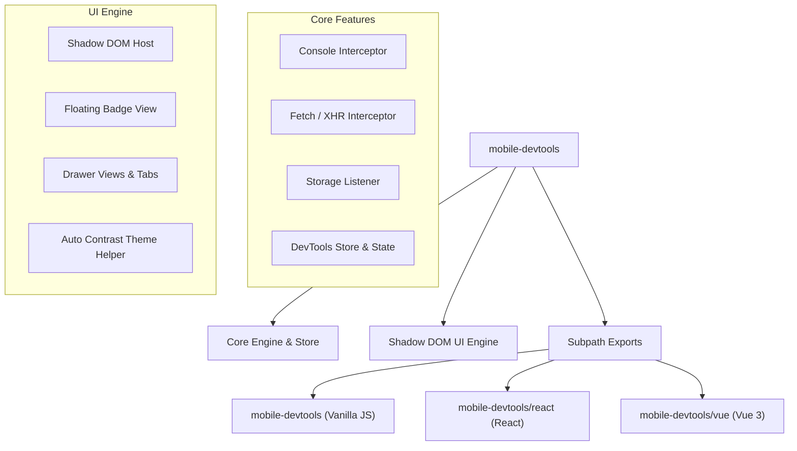

# Mobile DevTools

> **Next-Gen Framework-Agnostic In-App Mobile Debugger & Inspector Overlay for Web Applications**

[](https://bundlephobia.com/)
[](https://opensource.org/licenses/MIT)
[](https://www.typescriptlang.org/)
[](https://turbo.build/)
[](https://react.dev/)
[](https://vuejs.org/)
[](https://developer.mozilla.org/en-US/docs/Web/JavaScript)

---

## 📌 Table of Contents

- [💡 Motivation & Why Use It?](#-motivation--why-use-it)
- [✨ Core Capabilities](#-core-capabilities)
- [🏗️ Technical Architecture](#%EF%B8%8F-technical-architecture)
- [🚀 Framework Quickstart](#-framework-quickstart)
  - [⚛️ React Integration](#%EF%B8%8F-react-integration)
  - [💚 Vue 3 Integration](#-vue-3-integration)
  - [🍦 Vanilla JS / Legacy Apps](#-vanilla-js--legacy-apps)
- [⚙️ Full Configuration & Props Reference](#%EF%B8%8F-full-configuration--props-reference)
- [🎨 Theme Engine & Customization](#-theme-engine--customization)
- [📂 Monorepo Structure](#-monorepo-structure)
- [🛠️ Development Setup](#%EF%B8%8F-development-setup)
- [📄 License](#-license)

---

## 💡 Motivation & Why Use It?

Debugging mobile web applications or QA staging builds on physical smartphones, tablets, or embedded webviews is historically painful:

- ❌ Requiring physical USB debugging cables connected to a desktop computer.
- ❌ Configuring Safari Remote Inspector or Chrome Inspect ports over local WiFi.
- ❌ Losing console logs when a mobile browser crashes or refreshes.
- ❌ Inability to inspect network traffic on production staging environments without desktop proxies (Charles / Fiddler / Proxyman).

**`mobile-devtools`** eliminates these pain points entirely. It embeds a lightweight, high-performance floating badge and overlay drawer directly inside your web application. You can inspect logs, monitor network calls, edit local storage, and inspect device specs anytime, anywhere — directly on screen without external tools or cables.

---

## ✨ Core Capabilities

- ⚡ **Ultra-Lightweight & Fast**: Extremely small footprint (**~2.0 kB gzipped** / **~5.7 kB minified**) with zero runtime dependencies, ensuring zero impact on page load speed or mobile frame rates.
- 🚀 **Quick Bug Exporter**: Instant 1-click bug report sharing via Web Share API (`navigator.share`) to WhatsApp, Telegram, Slack, AirDrop, or Email with file download and copy fallbacks.
- 🌐 **Network Throttling Simulator**: Simulate `Slow 3G`, `Fast 3G`, or `Offline` connection modes directly on mobile devices with synthetic latency injection.
- ⚡ **Cable-Free Mobile Inspection**: Debug directly on physical iOS / Android devices, mobile webviews, or mobile Safari/Chrome.
- 🛡️ **Shadow DOM Style Isolation**: Rendered inside a Shadow DOM container (`<mobile-devtools-root>`), guaranteeing **zero CSS leaks** into your app's global styles and **zero style pollution** from Tailwind, Bootstrap, or global CSS resets.
- 📋 **Console Tab**: Real-time capture of `console.log`, `info`, `warn`, `error`, and `debug` with live filter search and unread error badges.
- 🌐 **Network Tab**: Live interception of `fetch` and `XMLHttpRequest` calls with HTTP status indicators (`200 OK`, `500 Error`), latency timing, request/response headers, and JSON body previews.
- 💾 **Storage Tab**: Real-time inspector and editor for `localStorage`, `sessionStorage`, and `document.cookie`.
- 💻 **System Info Tab**: Real-time diagnostic monitor for viewport dimensions, device pixel ratio (DPR), user agent string, memory limit, and screen orientation.
- 🎨 **Dynamic Theme Engine**: Built-in Light Mode and Dark Mode with auto-contrast luminance detection, accent color swatches, and custom background palettes.
- 🧩 **Framework Agnostic**: Native support for **React 18/19**, **Vue 3**, and **Vanilla JS**.

---

## 🏗️ Technical Architecture



---

## 🚀 Framework Quickstart

### 📦 Installation

```bash
npm install mobile-devtools
# or
pnpm add mobile-devtools
```

---

### ⚛️ React Integration

Import from `mobile-devtools/react`:

```tsx
import React from 'react';
import { MobileDevTools } from 'mobile-devtools/react';

export default function App() {
  return (
    <>
      <YourAppRoutes />

      {/* Mobile DevTools Overlay */}
      <MobileDevTools position="bottom-right" theme={{ mode: 'dark' }} />
    </>
  );
}
```

---

### 💚 Vue 3 Integration

Import from `mobile-devtools/vue`:

```html
<script setup>
  import { MobileDevTools } from 'mobile-devtools/vue';
</script>

<template>
  <YourAppLayout />
  <MobileDevTools position="bottom-right" :theme="{ mode: 'dark' }" />
</template>
```

---

### 🍦 Vanilla JS / Legacy Apps

Import directly from `mobile-devtools`:

```typescript
import { createMobileDevTools } from 'mobile-devtools';

// Instantiate DevTools overlay
const devtools = createMobileDevTools({
  title: 'My App Debugger',
  position: 'bottom-right',
  theme: {
    mode: 'dark',
    accentColor: '#0070f3',
  },
});
```

---

## ⚙️ Full Configuration & Props Reference

Below is the complete reference table for all configuration options supported by `<MobileDevTools />` / `createMobileDevTools()`:

| Option / Prop               | Type                  | Default                                       | Description                                                                                                                           |
| :-------------------------- | :-------------------- | :-------------------------------------------- | :------------------------------------------------------------------------------------------------------------------------------------ |
| `title`                     | `string`              | `'DevTools'`                                  | Label shown on floating badge and drawer header                                                                                       |
| `icon`                      | `string`              | `undefined`                                   | Custom icon (Emoji string like `'⚡'`, Image URL, or Base64 data URI)                                                                 |
| `position`                  | `BadgePositionPreset` | `'bottom-right'`                              | Initial corner/edge preset (`'bottom-right'`, `'bottom-left'`, `'top-right'`, `'top-left'`, `'bottom'`, `'top'`, `'left'`, `'right'`) |
| `initialTab`                | `DevToolsTabId`       | `'console'`                                   | Default tab opened when drawer is triggered (`'console'`, `'network'`, `'storage'`, `'system'`)                                       |
| `enabledTabs`               | `DevToolsTabId[]`     | `['console', 'network', 'storage', 'system']` | Filter which tabs are enabled in drawer                                                                                               |
| `defaultOpen`               | `boolean`             | `false`                                       | Set to `true` to open drawer automatically on mount                                                                                   |
| `autoSnapBadge`             | `boolean`             | `false`                                       | Enable magnetic snapping of badge to nearest screen edge                                                                              |
| `theme.mode`                | `'dark' \| 'light'`   | `'dark'`                                      | Theme mode                                                                                                                            |
| `theme.accentColor`         | `string`              | `undefined`                                   | Custom primary accent color (Hex / RGB / HSL)                                                                                         |
| `theme.backgroundColor`     | `string`              | `undefined`                                   | Custom background color for drawer and badge                                                                                          |
| `theme.cardBackgroundColor` | `string`              | `undefined`                                   | Custom background color for inner card elements                                                                                       |
| `interceptors.maxLogLimit`  | `number`              | `200`                                         | Maximum number of console logs stored in buffer                                                                                       |

---

## 🎨 Theme Engine & Customization

`mobile-devtools` features a built-in theme engine that automatically calculates background brightness to maintain **WCAG AAA readable text contrast**:

```tsx
<MobileDevTools
  title="Staging Debugger"
  icon="🚀"
  position="bottom-left"
  theme={{
    mode: 'dark',
    accentColor: '#10b981',
    backgroundColor: '#0c0c0e',
  }}
/>
```

---

## 📂 Monorepo Structure

```
react-mobile-devtools/
├── apps/
│   └── web/                    # Next-gen React documentation & live playground app
├── examples/
│   ├── react/                  # React 19 test harness app (Port 3001)
│   ├── vue/                    # Vue 3 test harness app (Port 3002)
│   └── vanilla/                # Vanilla JS test harness app (Port 3003)
└── packages/
    ├── mobile-devtools/        # Main unified published npm package (Core + UI + React/Vue/Vanilla Adapters)
    └── config/
        ├── eslint/             # Shared ESLint configuration (@mobile-devtools/eslint-config)
        └── typescript/         # Shared TypeScript configuration (@mobile-devtools/tsconfig)
```

---

## 🛠️ Development Setup

To build and run the project locally:

```bash
# Clone repository
git clone https://github.com/user/react-mobile-devtools.git
cd react-mobile-devtools

# Install dependencies using pnpm
pnpm install

# Launch all apps & package watchers in dev mode
pnpm dev

# Type check all 11 monorepo packages
pnpm check-types

# Build production bundles
pnpm build
```

---

## 📄 License

Distributed under the **MIT License**. See [LICENSE](./LICENSE) for details.
