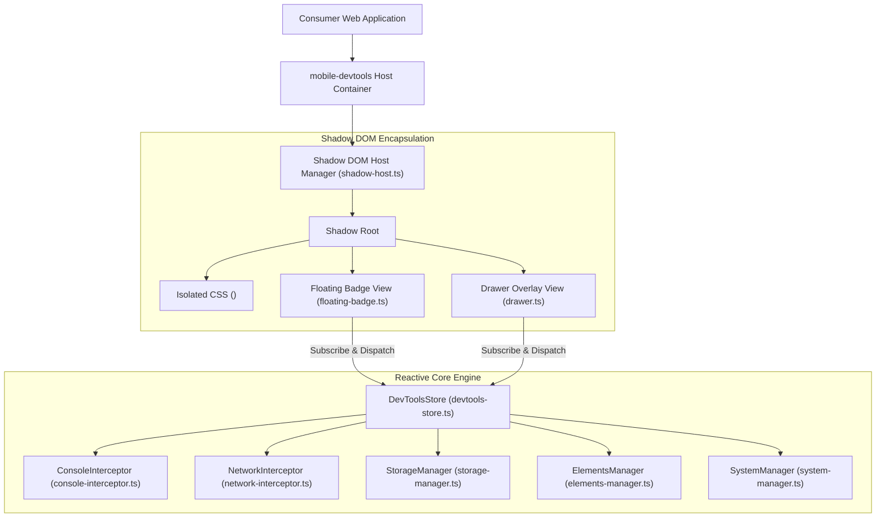

# 01. Technical Architecture & Design

`mobile-devtools` is designed from the ground up to provide a robust, non-intrusive, framework-agnostic debugging experience for modern web applications.

---

## 🏗️ High-Level System Architecture



---

## 🛡️ 1. Native Shadow DOM Encapsulation

A major flaw in traditional mobile debugging overlays is CSS leaking. Global CSS frameworks (Tailwind, Bootstrap) or global resets (`* { box-sizing: border-box; margin: 0; }`) often break the debugger UI, or conversely, the debugger's CSS contaminates the host application's styles.

`mobile-devtools` solves this completely using **Native Shadow DOM (`open` mode)**:

- **Host Element Creation**: Instantiates a custom host element `<mobile-devtools-root>`.
- **Style Ingestion**: Injects internal atomic CSS (`SHADOW_STYLES`) directly into the shadow root.
- **Isolation Scope**: DOM queries (`document.querySelector`) performed by the consumer application cannot accidentally select or modify elements inside DevTools.
- **Theme Variables**: Theme variables (e.g. `--dev-bg`, `--dev-accent`, `--dev-text`) are dynamically scoped inside the shadow host root.

```ts
// Core implementation snippet in shadow-host.ts
export class ShadowHostManager {
  private hostElement: HTMLElement;
  private shadowRoot: ShadowRoot;

  constructor() {
    this.hostElement = document.createElement('mobile-devtools-root');
    this.shadowRoot = this.hostElement.attachShadow({ mode: 'open' });
  }

  public injectStyles(cssText: string) {
    const styleEl = document.createElement('style');
    styleEl.textContent = cssText;
    this.shadowRoot.appendChild(styleEl);
  }
}
```

---

## ⚡ 2. Reactive Store State Management (`DevToolsStore`)

All application state (active tab, drawer open status, theme mode, captured logs, network transactions, unread error counts, and configuration settings) is managed centrally by `DevToolsStore`:

- **Event Listener Pattern**: UI views subscribe to store updates (`store.subscribe(callback)`).
- **Unread Error Counters**: Automatically tracks unread console errors (`unread.errors`) and warnings (`unread.warnings`). Opening the drawer automatically resets unread counters.
- **Immutability & Buffer Caps**: Log buffers are automatically trimmed based on `config.interceptors.maxLogLimit` (default `200`) to prevent memory leaks during long debugging sessions.

---

## 📡 3. Interceptor Mechanics

### A. Console Interceptor (`ConsoleInterceptor`)

- Monkey-patches standard `console` methods (`log`, `info`, `warn`, `error`, `debug`).
- Preserves original console output so browser developer tools still receive logs.
- Captures stack traces for error entries.
- Safely stringifies complex circular JS objects using a custom recursive JSON formatter.

### B. Network Interceptor (`NetworkInterceptor`)

- Intercepts both modern **`window.fetch`** API and legacy **`XMLHttpRequest`** (XHR).
- Records HTTP request/response headers, status codes (`200 OK`, `404 Not Found`, `500 Server Error`), request payloads, and response bodies.
- Measures network latency duration in milliseconds.
- Applies automatic sensitive data masking (`privacy.mask`) to scrub tokens, cookies, passwords, and authorization headers before rendering.
- Implements synthetic network throttling simulation (`Slow 3G`, `Fast 3G`, `Offline`).

---

## 🌳 4. Elements Inspector (`ElementsManager`)

- **Interactive Node Picker**: Highlights hovered/tapped DOM elements on the screen.
- **DOM Tree Browser**: Renders a collapsible node hierarchy tree with tag names, attributes, classes, and inner text content.
- **Box Model Viewer**: Calculates exact computed layout bounds (`margin`, `border`, `padding`, `content`) using `window.getComputedStyle()`.
- **Grouped Style Categories**: Groups computed CSS properties into logical categories: **Layout**, **Flexbox**, **Grid**, **Typography**, and **Colors**.
